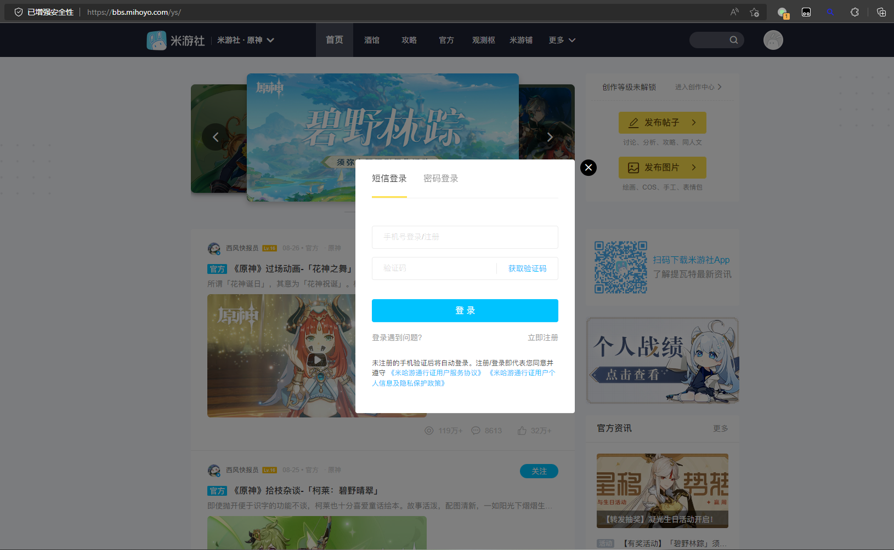
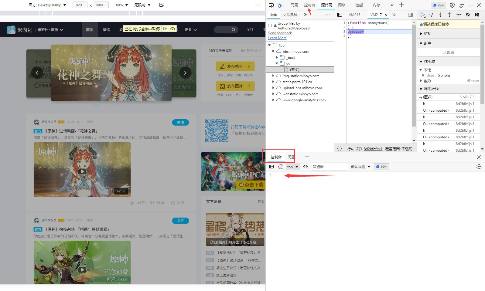
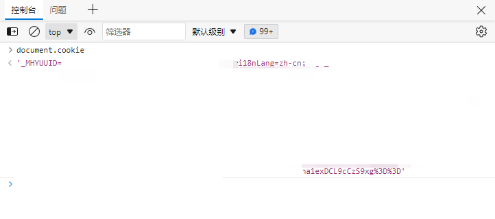

# 在Paimon中添加Cookie

在`koishi-plugin-paimon`中添加Cookie可以获得完整的体验，从获取米游社的小饼干开始。

本篇文档托管于GitHub，在国内访问时可能会出现图片无法加载的情况，如果因此让您无法正确操作，您可以阅读其他相关文档。

## 获取Cookie

> <h3 style="color: red;">如果您不信任该机器人，请不要配置！</h3>
> <h3 style="color: red;">如果您不信任该机器人，请不要配置！</h3>
> <h3 style="color: red;">Cookie请不要泄露或交给人任何人！</h3>
> <h3 style="color: red;">Cookie请不要泄露或交给人任何人！</h3>
> <h3 style="color: red;">如果Cookie不慎泄露，请立即访问<a href="https://bbs.mihoyo.com/ys/">https://bbs.mihoyo.com/ys/</a>退出登录！</h3>

访问 [米游社BBS](https://bbs.mihoyo.com/ys/) 后进行`登录`



`登录后`按下 <kbd>F12</kbd> 打开`开发者工具(Developer Tools)`,然后找到`控制台(Console)`



然后开始获得cookie，下列有两种方法：

<details>
<summary>手动复制</summary>

鼠标放在 ` > ` 处输入 `document.cookie`后，按下<kbd>Enter</kbd>（`回车键`）：



将`cookie`鼠标双击全选后按下<kbd>Ctrl</kbd>+<kbd>C</kbd>复制便可。

</details>

<details>
<summary>自动复制</summary>

鼠标放在 ` > ` 处粘贴下列代码后，按下<kbd>Enter</kbd>（`回车键`）：
 ```JavaScript
 (window.navigator.clipboard.writeText(`'${document.cookie}'`).then(() => {console.log('copied');}).catch(() => {const input = document.createElement('input');document.body.appendChild(input);input.setAttribute('value', `'${document.cookie}'`);input.select();if (document.execCommand('copy')) {document.execCommand('copy');}console.log('exec copied');document.body.removeChild(input);}))
 ```
 
 - 执行后将会自动复制到剪切板。
</details>

 Done！一切准备已经就绪了，是时候将Cookie添加到机器人了！

## 添加Cookie到机器人

> 该项目是`Koishi`框架的一个插件，如果机器人不基于`koishi`与`koishi-plugin-paimon`，请自行阅读相关文档或帮助提示。
> 
> 如何确定我所使用的机器人是基于`paimon`的？
> 
> - 可以输入如下内容进行测试：
> ```
> ys --help
> ```
> 如果得到响应内容，则可以使用下面命令进行设置。

与机器人进行 **<span style="color: red;">私聊</span>** ，输入如下内容：

```Shell
ys -ck '从米游社获得的Cookie'
```

- `-ck` 是命令 `--cookie` 的别名(或者叫简称)，所以也可将 `-ck` 替换为 `--cookie`；两者是等价的。
- **<span style="color: red;">请不要在群聊中发送上述内容，机器人并不会在群内响应该命令，并会造成您的cookie泄露</span>**

### 机器人管理员

请在控制面板或配置文件中添加公共查询cookie，详情请参阅[README](../README.md)